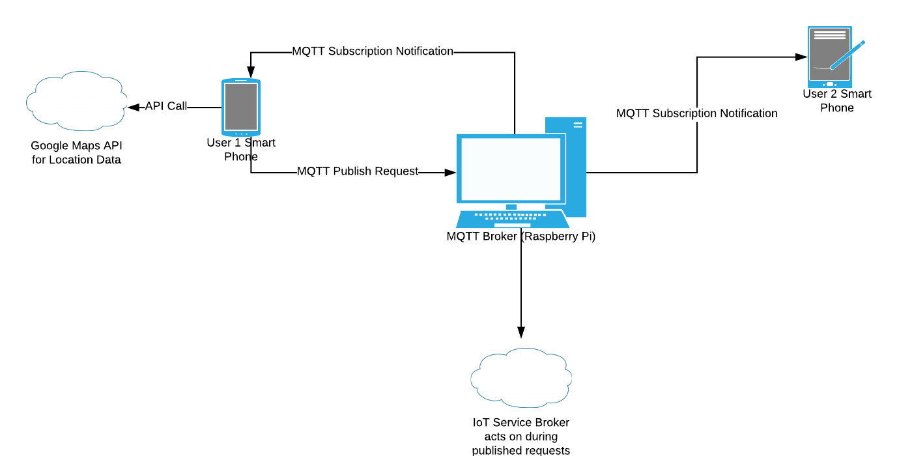

# WhereAbouts - Where u @ fam? 
**Project Idea for CYBR8480 - Secure Mobile Development class at the University of Nebraska Omaha**

## Executive Summary
Google Maps, Waze, Uber, GrubHub, the list of popular location based services continues to grow for smartphone users. The concept of a person or company knowing your exact location in a matter of seconds, a concept that just a decade ago sounded completely foreign to the average user, is now a tried and true business strategy for bringing the services of the internet to your exact location. When it comes to location tracking by private individuals though, many more people are less comfortable with that idea, even within the confines of family and close friends
WhereAbouts is an effort to put a friendlier face on location tracking loved ones, by putting the power of where your location data is going in your hands. 

## Project Goals
* Connect to MQTT Broker using TLS secured connection
* Publish location data on MQTT broker through secured connection
* Connect to MQTT broker (Raspberry Pi) through bluetooth to get security certificate and configure user credentials
* Establish Geofence Waypoints to trigger enter/exit reactions to trigger changes

## Application Requirements
For this project I set 3 primary user stories and then a stretch goal with waypoints

### User Stories
As a ***Publisher*** I want to ***Publish location data through secured connection*** so that I can ***Tell my wife that I'm heading home***

***Acceptance Criteria:***
* A user will be able to connect to an MQTT broker through a secure TLS-encrypted connection
* Once connected, a user will automatically publish their GPS location to the secured broker

As a ***Subscriber*** I want to ***Connect and subscribe to location data from the Publisher*** so that I can ***Be notified that my husband is heading home***

***Acceptance Criteria***
* A different user than the publisher will simultaneously connect to an MQTT broker through a secure TLS-encrypted connection
* Once connected, the user will subscribe to the topic that the publisher is publishing their location to, and will receive the GPS location data automatically when the original user publishes it.

As a ***New User*** I want to ***Setup secure MQTT broker on the Raspberry Pi*** so that I can ***Securely publish and subscribe to location notifications*** 

***Acceptance Criteria***
* The MQTT broker can be hosted on a Raspberry Pi, which can be setup with Node-Red to receive notifications from itself (through a subscription to the broker)
* When setting up the broker, the user can obtain the TLS certificate and user credentials through a bluetooth connection to the already running Raspberry Pi

### Stretch Goal - Google Maps integration with waypoints
As a ***New User*** I want to ***Set geofence waypoints*** so that I can ***Customize the notifications published to the broker***

***Acceptance Criteria***
* The user publishing their location will open a Google maps view where they can select an address or their current location
* Once they have the location for a new waypoint created, they input the radius of their waypoint and save the new way point
* Whenever they enter or exit where the waypoint is setup at, a custom notification is generated and published to the MQTT broker

### Misuser Stories
As a ***malicious phone hacker***, I want to ***sniff packets of published location data requests*** so I can ***get unauthorized access to the user's location and subscriptions***

***Mitigations:***
* Use TLS encryption for MQTT published messages 
* Application should also only publish location data to the authorized MQTT broker through secure channel with authentication

As a ***bad actor*** I want to ***steal TLS certificate and user credentials during bluetooth transfer*** so I can ***gain unauthorized access to the MQTT broker***

***Mitigations***
* Encrypt plain text of TLS certificate and credentials before sending over less secure BLE connection
* Find a way to limit BLE broadcast on Raspberry Pi to shorter range since bluetooth data transfer only happens on new device setups.

## High Level Design

## Components List

### Hardware Components
* At least 2 Android Phones - Runs the WhereAbouts app and either publishes or subscribes to new GPS coordinates published
* Raspberry Pi - Acts as MQTT broker to receive requests from phones.

### Software Components
* Android MQTT Library - Currently checking out [Eclipse Paho project for messaging](https://www.eclipse.org/paho/)
* MQTT Broker Server Software (on the Raspberry Pi) - Currently leaning towards [Mosquitto](https://mosquitto.org/)
* Google Maps API for Waypoint configuration

